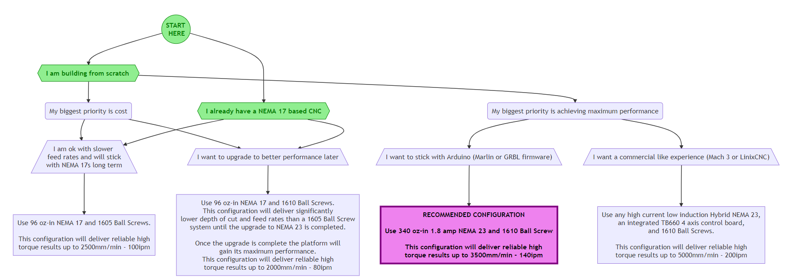

## FAQ
### You 3D printed a CNC?!
Yes and so can you!

### Can an existing CNC be converted into a PrintNC?
Yes, the dual NEMA17 version of the PrintNC was designed specifically for anyone who already has an existing CNC build using Nema 17’s or 23’s and wanting to upgrade it to a more capable machine but keep the cost low by using their existing components

The NEMA23 version is recommended for anyone building from scratch.

### Which version of the PrintNC should I build?

### What size frame material do I need?
The PrintNC stl files are available for two frame cross sections:

75 mm x 50 mm for metric countries

3 inch x 2 inch for imperial countries

STLs can be generated for other cross section dimensions by modifying the publicly published STEP files or requesting custom STLs for a small fee in the store.

### What is the working area of the PrintNC?
The linear kit for sale in the store provides an approximate working area of 1050 mm x 650 mm x 65 mm (41” x 25” x 2.5”)

Larger or smaller can easily be adapted without sacrificing performance.

### How large can the PrinNC be scaled?
First of all the orientation of the X and Y axis (x wider than Y axis) in the standard size PrintNC was chosen to give you a better access to the work area without limitations to the rigidity. 
When scaling/planning the PrintNC workspace larger it is better to change the orientation in a way that the Y axis is the longer one of both to avid loss of rigidity and avoid chattering.
Going on the X workspace larger than 1000mm (39") will, depending on the weigth of the used Z assembly (used spindle etc.), most likely cause a bit of sagging in the X steel beam and the chance of bending forces in Y direction.
In that cases increasing the thickness of the X steal beam can avoid this to a certain amount. 
As seen in many other CNC designs planning/building the PrintNC in extreme dimensions will need some practical experience, trials and will be more the exeption in the main stream of builds.    

### How much will building a PrintNC cost?
The machine can be built for approximately $1000 USD including the parts not currently available from the [Three Design Store](https://threedesign.store/store/). Everything you need to build a PrintNC except a spindle, steel box section, and stepper motors can be found for about $850 AUD(~$585 USD) plus shipping if you buy from the [Three Design Store](https://threedesign.store/store/). The standard size kits will build a machine with an approximate working area of 1050 mm x 650 mm (41” x 25”).

The parts which would be purchased from the store includes:

1 linear motion kit ($549 AUD/~$375 USD)

1 printed parts kit ($195 AUD/~$135 USD)

1 assorted small parts kit ($35 AUD/ ~$25 USD)

1 aluminum face plate ($75 AUD/~$50 USD)

#### Estimates for the parts not available from the store:
5 stepper motors ($50-$75 USD)

1 stepper motor controller

RAMPS 1.4 + drivers(~$50 USD)
Steel box section (~$75-$175 USD) + shipping if applicable

Low cost spindle (~$100 USD)

#### Steel box section options:

Steel is ~3 stiffer than Aluminum. Wall thickness recommended for steel section is 2.5mm (0.1″) Do not go thicker than 5mm or 0.2″

* 75 mm x 50 mm commonly available in 3 meter and 6 meter lengths
  * 1pcs 3 meter for 3x 800 mm
  * 1pcs 6 meter for 1x 1335mm and 2x 1300mm
* 3 inch x 2 inch available in 24 foot lengths (quotes from a local purchase option in US)
  * Cost totals per gauge:
    * 14 gauge thickness(.078”) ~$75 USD (incl. cutting fee)
      * Not recommended for machines which will need to tolerate any significant forces
    * 7 gauge thickness (.188”) ~$170 USD (incl. cutting fee)
  * Purchase breakdown:
    * 5$ cutting fee to cut purchase to size moveable by car
* 3 inch x 2 inch available in 1 foot lengths up to 7 feet (online option for US)
  * Cost totals per gauge:
    * 11 gauge thickness(.120″)  ~$100
    * 7 gauge thickness (.188”) ~$130
* Purchase breakdown:
  * 2pcs 7’(2133.6mm) for 1x 800 mm and 1x 1300mm [33.6mm leftover]
    * 11 gauge thickness(.120″) ~$31ea./7ft = ~$65
    * 7 gauge thickness (.188”) ~$42ea./7ft = ~$85
    * 1pcs 4’(1219.2mm) for 1x 800 mm, 1x 135mm, and 2x 70mm [144mm leftover]
    * 11 gauge thickness(.120″) ~$19ea./4f
    * 7 gauge thickness (.188”) ~$26ea./4ft
    * 1pcs 5’(1524mm) for 1x 1335 mm and 1x 135mm [54mm leftover]
    * 11 gauge thickness(.120″) ~$23ea./5f
    * 7 gauge thickness (.188”) ~$32ea./5ft
